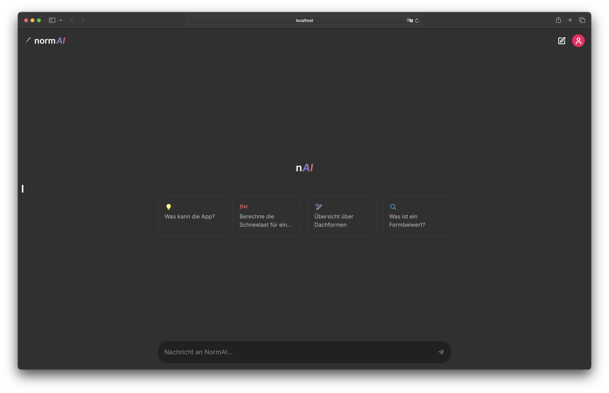
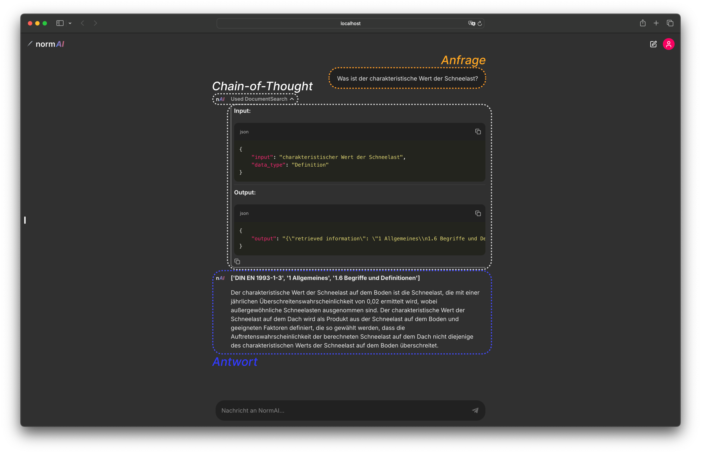
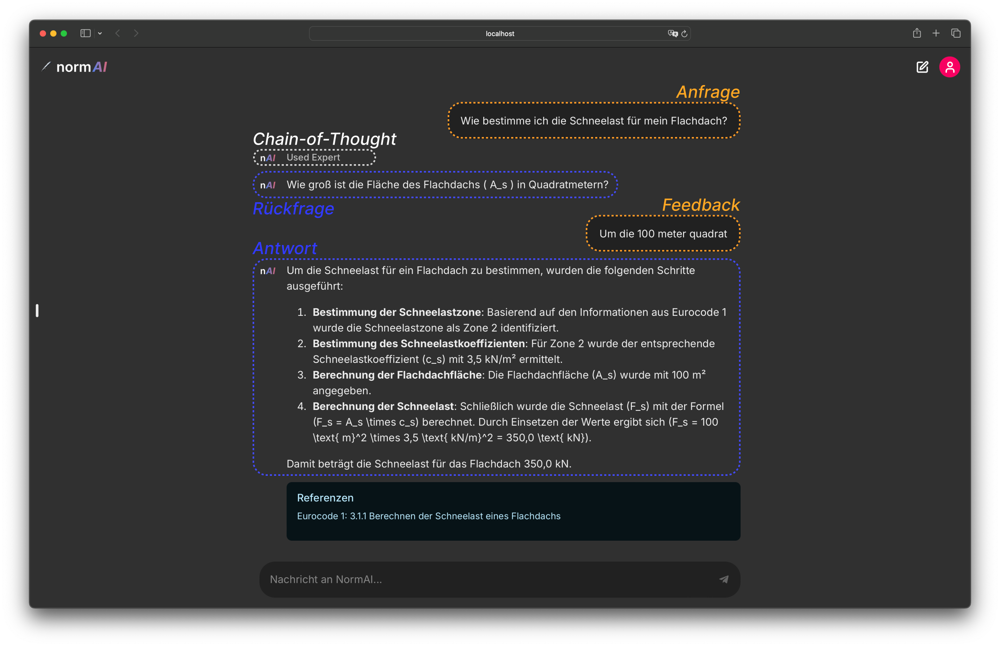

<a href="https://doi.org/10.5281/zenodo.13930606"></a>

# Companion Repository to the Masters Thesis "Natural Language Processing for Standards"

This repository contains the source code of the Web-application with a dedicated UI. The main logic is forked from the [normGraph](https://github.com/isamul/normGraph) repository. Consult the main repository for details about the application logic. **normAI** is a conversational chat-application using generative language models to work with building codes and standards more intuitively. 

## User Interface
normAI's user interface looks like this when started in a web-browser:



You can ask normAI factual questions about a building standard and it will answer by giving precise references:



To increase transparency, the user can also take a look into the actions the application makes by expanding the Chain-of-Thought (CoT) UI element.

It is also possible to ask normAI more complex questions requiring multiple steps to solve. The application is also capable of conducting mathmatical calculations that go beyond simple arithmetic operations. Answers to more complex questions are made transparent by the CoT UI element as well.



## Installation

This repository is structured as follows:

```
normAI/
├── .chainlit/          # config files for the chainlit-framework
├── base_agent/         # main application backend
├── img/                
├── public/             # public image ressources
├── .env                # environment variables required for running the app
├── app.py              # main ui logic         
└── requirements.txt    # file containing application dependencies

```

**Installation steps**:
1. make sure that a neo4j instance has been set up by following the instructions in the [normGraph](https://github.com/isamul/normGraph) respository
2. clone the **normAI** repository:
```shell
git clone https://github.com/isamul/normAI.git
```
3. install the dependencies by executing the command below after opening the repository from the command line:
```shell
pip install -r requirements.txt
```
4. make sure that all environment variables (API-keys) are set in `.env`, a template `.env` file can be created by entering the following command:
```shell
cp .env.example .env
```
5. run the normAI application by executing the command below:
```shell
chainlit run app.py
```

