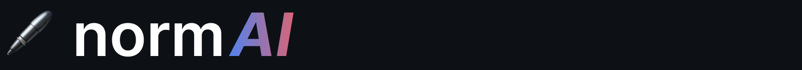

# Companion Repository to the Masters Thesis 
# "Natural Language Processing for Standards"

This repository contains the source code of the Web-application with a dedicated UI. The main logic is forked from the [normGraph](https://github.com/isamul/normGraph) repository.

- ui screenshot
- file structure
- how to run
